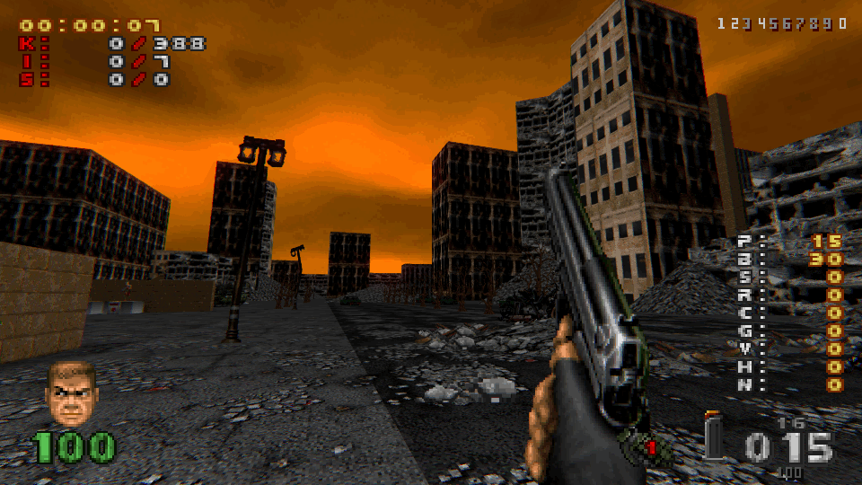

# Brutal Doom Minimalist HUD
Minimalistic HUD for Brutal Doom v22 inspired by [Minimalist HUD](https://www.moddb.com/mods/brutal-doom/addons/minimalist-hud) by [BluB0x](https://www.moddb.com/members/blub0x)

## Differences from original HUD
- Added Brutal Doom v22 support (instead of Project Brutality);
- Added **Zandronum** compatibility;
- Added HUD scaling compatibility;
- Added [Cat's Frozen Addon](https://www.moddb.com/mods/brutal-doom/addons/bdv22-cats-frozen-addon-v20) support (ONLY GZDOOM);

## Screenshots

