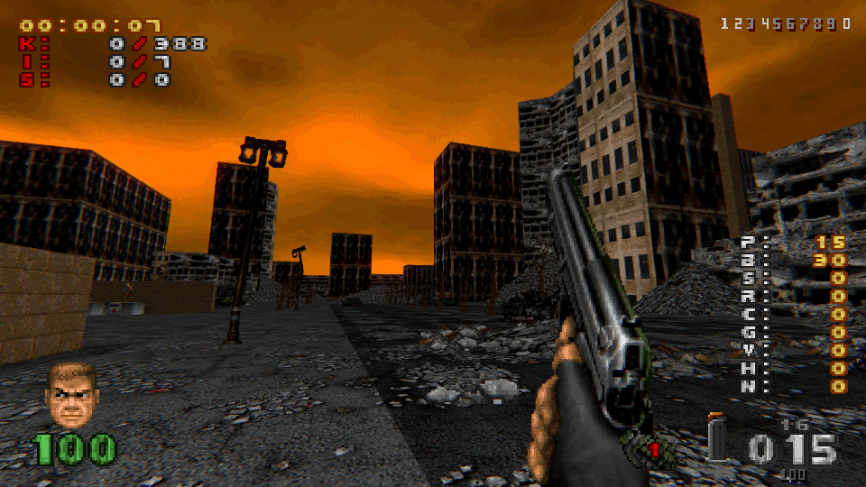
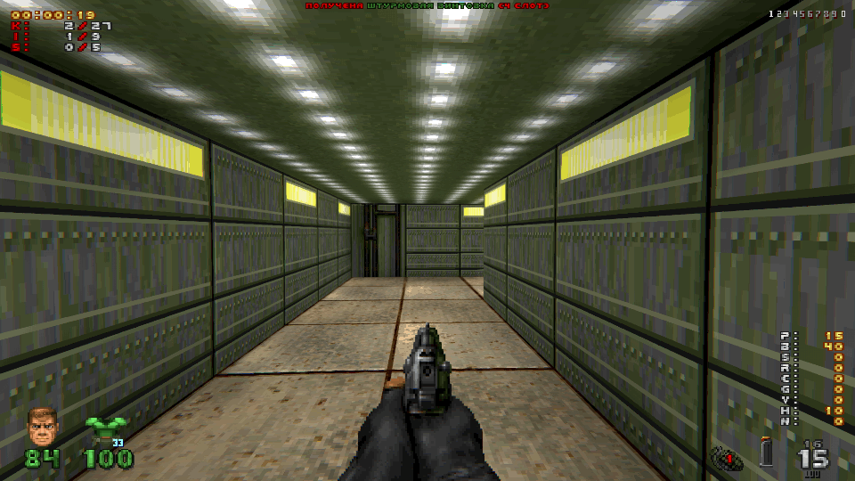

# Brutal Doom Minimalist HUD
Минималистичный интерфейс для Brutal Doom v22, вдохновлённый [Minimalist HUD](https://www.moddb.com/mods/brutal-doom/addons/minimalist-hud) от автора [BluB0x](https://www.moddb.com/members/blub0x)

## Отличия от оригинального мода
- Поддержка Brutal Doom v22 (вместо Project Brutality);
- Поддержка **Zandronum**, GZDoom, LZDoom;
- Поддержка масштабируемости;
- Поддержка [Cat's Frozen Addon](https://www.moddb.com/mods/brutal-doom/addons/bdv22-cats-frozen-addon-v20);

## Скриншоты

